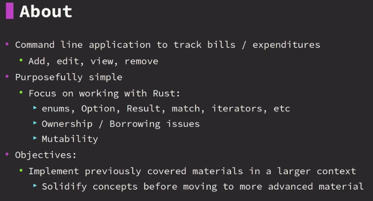
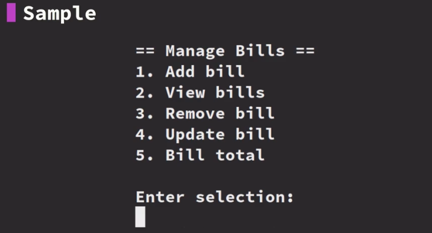

# Rust Mini Project: Interactive Bill Manager
- Its a mini project to solidify my understanding of the basic Rust concepts.
- This is an activity in the Rust Programming Course from the [ZTM Academy](https://academy.zerotomastery.io/p/learn-rust)

## About
- Menu driven command line application
    - Selects a menu by entering a number
    - Perform action based on which menu you are working with
- Makes use of:
    - Modules
    - Enums
    - Options
    - Result
    - Match
    - Structs
    - Iterators
- Advanced issues that will be tackled
    - ownership and mutability problems
- Good practice for:
    - basics of Rust
    - reading compiler errors
    - understanding ownership and mutability




## Summary
> Create a command line bills/expenses manager that runs
> interactively. This mini project brings together many of
> the concepts learn thus far into a single application.
>
> The user stories/requirements are split into stages.
> Fully implement each stage as a complete working program
> before making changes for the next stage. Leverage the
> compiler by using `cargo check --bin bill_manager` when changing
> between stages to help identify adjustments that need
> to be made.

## User Stories
- The idea is to complete the user stories
- Start with user story 1 completely before moving on to the next.

> User stories:
> * Stage 1:
>   - I want to add bills, including the name and amount owed.
>   - I want to view existing bills.
> * Stage 2:
>   - I want to remove bills.
> * Stage 3:
>   - I want to edit existing bills.
>   - I want to go back if I change my mind.

> Rust is a fantastic language for refactoring code that's why the project is structured into three stages.
> 
> Each stage will require a multitude of changes and you'll be able to use the compiler diagnostics to help you out when you need to change your code. 

## Tips
> Tips:
> * Use the loop keyword to create an interactive menu.
> * Each menu choice should be it's own function, so you can work on the
>   the functionality for that menu in isolation.
> * A vector is the easiest way to store the bills at stage 1, but a
>   hashmap will be easier to work with at stages 2 and 3.

## Development Steps

### Create a support function for managing user input
- create string buffer
- loop over the input using `io` module from the standard `std` library
    - if user does something wrong or if there’s an error in the terminal then we just loop over until we get some valid data
    - trim the whitespace on the terminal entry (when user press enter there’s going to be a new line at the end) from the `.read_line`
        - turn it to an owned string because we are returning an Optional owned String on our function
    - if input is empty return `None`, else we get the input which is an Option<String>
```
use std::io;

fn get_input() -> Option<String> {
    let mut buff = String::new();
    while io::stdin().read_line(&mut buff).is_err() {
        println!("Please enter your data again.");
    }
    let input = buff.trim().to_owned();
    if input == "" {
        return None;
    } else {
        return Some(input);
    }
}
```

### Create the main menu loop
- create an `Enum` for our main menu
    - add bill and view bill first for our first user story
- create a function for the our MainMenu enum to take input from the user and return a `MainMenu` variant
    - this will act as a check to see if our user enters a menu that is correct or incorrect.
    - if its correct we get the `Option<MainMenu>` back, else we get `None` for bad input
    - `match` on the `input` and let’s use a number system for selection
        - if they enter anything else, return `None`
- create another function to display the menu
- create the main menu loop in the main function
    - show the menu
    - get user input
        - for debugging purposes, we can use expect(). when the user hits enter with nothing the program will jut terminate with the message.
    - do a match on the from_str() when it takes in the user input, so we can check which option the user selected
        - for now we’ll use the `()` type when a valid Menu is selected
            - `()` type just means nothing. to be updated later
        - just return when invalid Menu is selected
```
enum MainMenu {
    AddBill,
    ViewBill,
}

impl MainMenu {
    fn from_str(input: &str) -> Option<MainMenu> {
        match input {
            "1" => Some(MainMenu::AddBill),
            "2" => Some(MainMenu::ViewBill),
            _ => None,
        }
    }

    fn show() {
        println!("");
        println!(" == Bill Manager ==");
        println!("1. Add Bill");
        println!("2. View Bill");
    }
}

fn main() {
    loop {
        MainMenu::show();
        let user_input = get_input().expect("no data entered");
        match MainMenu::from_str(&user_input) {
            Some(MainMenu::AddBill) => (),
            Some(MainMenu::ViewBill) => (),
            None => return,
        }
    }
}
```
